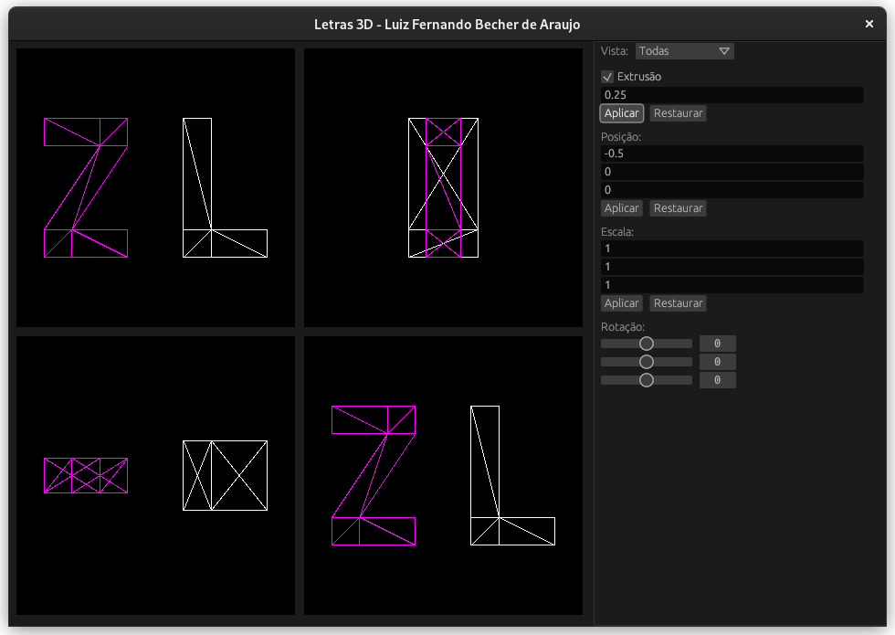

# letras3d

Trabalho final da disciplina de Computação Gráfica.

## Como compilar e executar

Certifique-se de ter o compilador do Rust instalado: [Instale o Rust](https://www.rust-lang.org/tools/install).

Depois, execute o comando abaixo na raiz do projeto:

```
cargo run -r
```

## Como usar

Aperte qualquer letra ou número do teclado para adicionar na visualização.
Use as setas para equerda e para direita do teclado para selecionar os objetos
(a cor passará de branco para rosa quando um objeto for selecionado). Na barra
lateral, use as opções disponíveis para realizar as manipulações desejadas
sobre o objeto selecionado.

OBS: Atualmente os únicos símbolos modelados são L, U, I e Z.

  